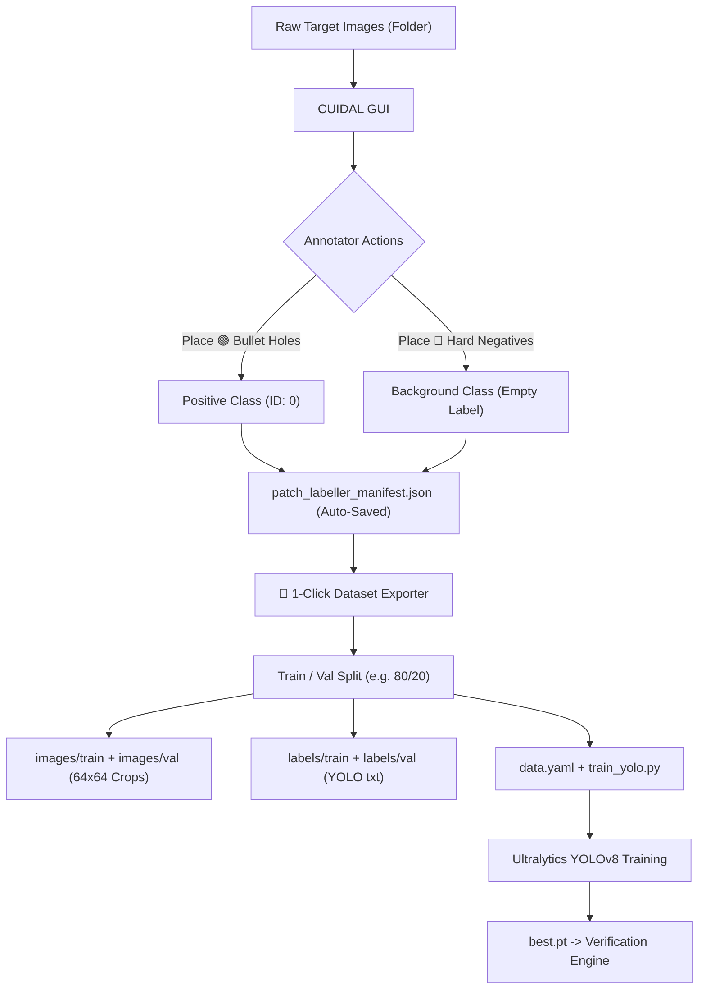

# 🎯 CUIDAL — Custom Image Dataset Labeller
**Bullet Hole & Hard-Negative Patch Dataset Builder for YOLO Ballistics Verification**

[](https://www.python.org/)
[](https://github.com/ultralytics/ultralytics)
[]()
[](https://opencv.org/)
[](LICENSE)
[]()

---

## 📖 Table of Contents
- [🎯 CUIDAL — Custom Image Dataset Labeller](#-cuidal--custom-image-dataset-labeller)
  - [📖 Table of Contents](#-table-of-contents)
  - [💡 About CUIDAL](#-about-cuidal)
  - [🔍 Why Patch-Level Labelling?](#-why-patch-level-labelling)
  - [✨ Key Features](#-key-features)
  - [🏗️ Architecture \& Workflow](#️-architecture--workflow)
  - [🚀 Installation \& Quick Start](#-installation--quick-start)
    - [Option A: Standalone Executable (No Python Required)](#option-a-standalone-executable-no-python-required)
    - [Option B: Python Source (Windows / Linux / macOS)](#option-b-python-source-windows--linux--macos)
      - [Prerequisites](#prerequisites)
      - [1. Clone the Repository](#1-clone-the-repository)
      - [2. Launch on Windows](#2-launch-on-windows)
      - [3. Manual Launch (Linux / macOS / CLI)](#3-manual-launch-linux--macos--cli)
  - [🖥️ User Interface \& Controls](#️-user-interface--controls)
  - [⌨️ Complete Keyboard \& Mouse Shortcuts](#️-complete-keyboard--mouse-shortcuts)
  - [🎯 Labelling Best Practices](#-labelling-best-practices)
    - [1. Maintain a 1:1 Positive-to-Negative Ratio](#1-maintain-a-11-positive-to-negative-ratio)
    - [2. What to Sample as Hard Negatives (🔴 Background)](#2-what-to-sample-as-hard-negatives--background)
    - [3. Patch \& Caliber Sizing](#3-patch--caliber-sizing)
  - [🏋️‍♂️ YOLO Dataset Generation \& Training](#️️-yolo-dataset-generation--training)
    - [1. Generate Dataset](#1-generate-dataset)
    - [2. Train the Verifier Model](#2-train-the-verifier-model)
      - [Training Hyperparameters Configured by Exporter:](#training-hyperparameters-configured-by-exporter)
    - [3. Deploy Weights to Detection Pipeline](#3-deploy-weights-to-detection-pipeline)
  - [📁 Directory Structure](#-directory-structure)
  - [❓ Troubleshooting \& FAQ](#-troubleshooting--faq)
  - [📄 License](#-license)

---

## 💡 About CUIDAL

**CUIDAL** (**Cu**stom **I**mage **Da**taset **L**abeller) is an interactive, standalone dataset annotation and cropping tool built specifically for ballistics scoring and small-object detection. It allows users to place bounding patches over target images, maintain live class balance between positive bullet holes and hard-negative background samples, and export ready-to-train YOLO datasets with a single click.

---

## 🔍 Why Patch-Level Labelling?

Traditional object detection pipelines train YOLO on full-resolution camera frames ($1920\times1080$ or $1280\times720$). In ballistics scoring, this creates a severe **scale and context mismatch**:

| Aspect | Full-Frame Training ($1920\times1080$) | Patch-Level Training ($64\times64$ ROIs) |
| :--- | :--- | :--- |
| **Hole-to-Image Area** | $\approx 0.02\%$ of pixels | $\approx 35\text{--}50\%$ of pixels |
| **Receptive Field** | Dominated by background target paper | Focused entirely on puncture geometry |
| **False Positives** | High (triggers on target ring numbers, creases, staples) | **Near zero** (model learns micro-texture distinctions) |
| **Inference Speed** | Slow resizing & inference over full image | Extremely fast sub-millisecond patch verification |

**CUIDAL** solves this by generating $64\times64\text{ px}$ candidate crops directly from raw target imagery with paired **hard-negative background mining** and **live 1:1 class balancing**.

---

## ✨ Key Features

* 🎯 **Scale-Parity Annotations**: Tailored $64\text{ px}$, $96\text{ px}$, and $128\text{ px}$ crops matching the exact receptive field of real-time detection pipelines.
* ⚖️ **Live Class Balance HUD**: Real-time ratio tracking ($\text{Positives} : \text{Negatives}$) to prevent dataset class imbalance during annotation.
* 🛡️ **Exit Protection & Session Recovery**: Automatically remembers your last opened folder, last edited image, and crop dimensions. Intercepts window close to prevent accidental data loss.
* 🔍 **Fast Canvas Engine**: Hardware-accelerated cursor-centered zoom ($5\%\text{--}1000\%$) and smooth middle-click panning across multi-megapixel images.
* 🚀 **1-Click YOLO Dataset Engine**: Auto-crops, pads boundary edges with border replication, splits train/val sets, writes YOLO bounding boxes, and generates `data.yaml` + a ready-to-run `train_yolo.py`.
* ⚡ **Fast Windows Launcher (`run_labeller.bat`)**: Checks environment requirements on the first boot and caches results for sub-30ms subsequent launches.
* 📦 **Standalone Executable Available**: Pre-compiled single-file executable (`CUIDAL_Patch_Labeller.exe`) that runs out-of-the-box without requiring Python installation.

---

## 🏗️ Architecture & Workflow



---

## 🚀 Installation & Quick Start

### Option A: Standalone Executable (No Python Required)
1. Download **`CUIDAL_Patch_Labeller.exe`** from [Releases](https://github.com/Joel-GJA/CUIDAL/releases).
2. Double-click to run. Live logs stream into the attached console window and `%TEMP%\cuidal_patch_labeller.log`.

---

### Option B: Python Source (Windows / Linux / macOS)

#### Prerequisites
* **Python 3.9+** (ensure Python is added to your system PATH)

#### 1. Clone the Repository
```bash
git clone https://github.com/Joel-GJA/CUIDAL.git
cd CUIDAL
```

#### 2. Launch on Windows
Double-click **`run_labeller.bat`** or run in terminal:
```cmd
run_labeller.bat
```
> **Note**: On first run after system boot, the launcher verifies and installs any missing packages (`opencv-python`, `numpy`, `Pillow`, `ultralytics`). Subsequent launches start instantly.

#### 3. Manual Launch (Linux / macOS / CLI)
```bash
pip install -r requirements.txt
python patch_dataset_labeller.py
```

---

## 🖥️ User Interface & Controls

```
+-------------------------------------------------------------------------------+
| [📁 Open Images Dir]  [⚙️ Set Export Dir]  [◀ Prev (A)]  [Next (D) ▶]  [💾 Save] |
+-------------------------------------------------------+-----------------------+
|                                                       | 1. Class Selector     |
|                                                       |   (o) Bullet Hole (1) |
|                                                       |   ( ) Background  (2) |
|                                                       | --------------------- |
|                                                       | 2. Geometry Presets   |
|                   IMAGE CANVAS                        |   [64px] [96px] [128] |
|                                                       |   Crop: 64px Hole:18px|
|        🟢 Hole #1                 🔴 Bg #1            | --------------------- |
|                                                       | 3. Live Balance HUD   |
|                                                       |   Holes: 45 | Bg: 45  |
|                                                       |   Ratio: 1.00:1 (Perf)|
|                                                       | --------------------- |
|                                                       | 4. Images List        |
|                                                       |   ✓ [04 patches] 001  |
|                                                       |   ○ [unlabelled] 002  |
|                                                       | --------------------- |
|                                                       | 5. YOLO Export        |
|                                                       |   [🚀 Generate Dataset]|
+-------------------------------------------------------+-----------------------+
| Status: Ready. 12 images loaded.                      | Resumed Session       |
+-------------------------------------------------------------------------------+
```

---

## ⌨️ Complete Keyboard & Mouse Shortcuts

| Action | Shortcut / Input | Description |
| :--- | :--- | :--- |
| **Select Bullet Hole** | <kbd>1</kbd> | Sets active placement class to Positive Hole (Green) |
| **Select Background** | <kbd>2</kbd> | Sets active placement class to Hard Negative (Red) |
| **Place Patch** | <kbd>Left-Click</kbd> | Places a new square patch centered at cursor position |
| **Move Patch** | <kbd>Left-Drag</kbd> | Drags the selected patch across the image |
| **Delete Patch** | <kbd>Right-Click</kbd> | Deletes the patch directly under the mouse pointer |
| **Delete Selected** | <kbd>Delete</kbd> | Removes the currently highlighted patch |
| **Next Image** | <kbd>D</kbd> or <kbd>▶</kbd> | Automatically saves current annotations and loads next image |
| **Previous Image** | <kbd>A</kbd> or <kbd>◀</kbd> | Automatically saves current annotations and loads previous image |
| **Save Annotations** | <kbd>S</kbd> | Manually writes current annotations to folder manifest |
| **Zoom In / Out** | <kbd>Mouse Wheel</kbd> | Continuous zoom centered on cursor |
| **Pan Canvas** | <kbd>Middle-Drag</kbd> | Pans image across workspace when zoomed in |

---

## 🎯 Labelling Best Practices

To produce the highest quality YOLO verifier model:

### 1. Maintain a 1:1 Positive-to-Negative Ratio
* Aim for approximately equal counts of **`bullet_hole`** and **`background`** samples.
* The sidebar HUD displays a **Live Ratio**: keep it between `0.90 : 1` and `1.10 : 1`.

### 2. What to Sample as Hard Negatives (🔴 Background)
Do not only sample blank white paper. Effective hard negatives include:
* **Target Scoring Rings**: Curved black borders that can fool edge detectors.
* **Target Numbers & Text**: Digits (e.g., "7", "8", "9", "10") with high contrast.
* **Target Staples & Fasteners**: Metal glints and bracket edges.
* **Paper Creases & Folds**: Shadow lines and wrinkles on the target sheet.
* **Clean White/Black Paper**: Baseline reference samples.

### 3. Patch & Caliber Sizing
* **Receptive Field**: Default to **64 px** crops.
* **Caliber Hole Diameter**: Match your target's caliber size (e.g., 18 px for 4.5mm airgun pellets at 1080p).

---

## 🏋️‍♂️ YOLO Dataset Generation & Training

### 1. Generate Dataset
1. Set the **Val Split Slider** (default: `20%`).
2. Click **`🚀 Generate YOLO Dataset (Crops + data.yaml)`**.
3. The exporter will automatically crop every patch, create train/val splits, write YOLO bounding box annotations, and output `data.yaml` and `train_yolo.py`.

### 2. Train the Verifier Model
Run the generated training script inside your export directory:
```bash
python yolo_patch_dataset/train_yolo.py
```

#### Training Hyperparameters Configured by Exporter:
```python
from ultralytics import YOLO

model = YOLO("yolov8s.pt")
model.train(
    data="yolo_patch_dataset/data.yaml",
    epochs=100,
    imgsz=64,           # Exact patch resolution
    batch=32,
    mosaic=0.0,         # Disabled to preserve circular hole morphology
    degrees=180.0,      # Full rotation invariance for target orientation
    save=True,
    project="pilss_yolo_runs",
    name="bullet_verifier_yolov8s"
)
```

### 3. Deploy Weights to Detection Pipeline
When training completes:
1. Locate the best model weights at `pilss_yolo_runs/bullet_verifier_yolov8s/weights/best.pt`.
2. Copy `best.pt` into your detection pipeline and configure `yolo_verifier.py`.

---

## 📁 Directory Structure

```
CUIDAL/
├── patch_dataset_labeller.py  # Main Tkinter + PIL annotation application
├── check_environment.py       # Boot-cached dependency manager
├── run_labeller.bat           # 1-click Windows launcher script
├── requirements.txt           # Minimal Python package dependencies
├── README.md                  # Complete documentation & user guide
└── yolo_patch_dataset/        # Auto-generated upon export
    ├── data.yaml              # Ultralytics dataset configuration
    ├── train_yolo.py          # Standalone training script
    ├── images/
    │   ├── train/             # 64x64 image crops (Train set)
    │   └── val/               # 64x64 image crops (Validation set)
    └── labels/
        ├── train/             # YOLO format bounding box annotations
        └── val/               # (Positive = "0 cx cy w h", Negative = empty file)
```

---

## ❓ Troubleshooting & FAQ

<details>
<summary><b>Q: What happens if I accidentally close the window without saving?</b></summary>
The app intercepts the window close event (`WM_DELETE_WINDOW`) and prompts you with a dialog offering to <b>Save and Exit</b>, <b>Discard and Exit</b>, or <b>Cancel</b> to continue working.
</details>

<details>
<summary><b>Q: How does the labeller handle patches on the image boundary?</b></summary>
When a patch center is close to the image edge, the exporter automatically applies <code>cv2.BORDER_REPLICATE</code> padding before cropping, guaranteeing exact square dimensions without distorting the hole.
</details>

<details>
<summary><b>Q: How are negative/background samples formatted for YOLO?</b></summary>
In Ultralytics YOLO, background samples are represented by an empty <code>.txt</code> label file. This trains the neural network that the image patch contains zero objects, drastically cutting down false positive detections.
</details>

<details>
<summary><b>Q: How do I move to another machine?</b></summary>
Simply copy the <code>CUIDAL</code> folder and your images folder. The <code>patch_labeller_manifest.json</code> travels with the images folder, preserving all annotations across different computers.
</details>

---

## 📄 License

This project is licensed under the MIT License — see the [LICENSE](LICENSE) file for details.
